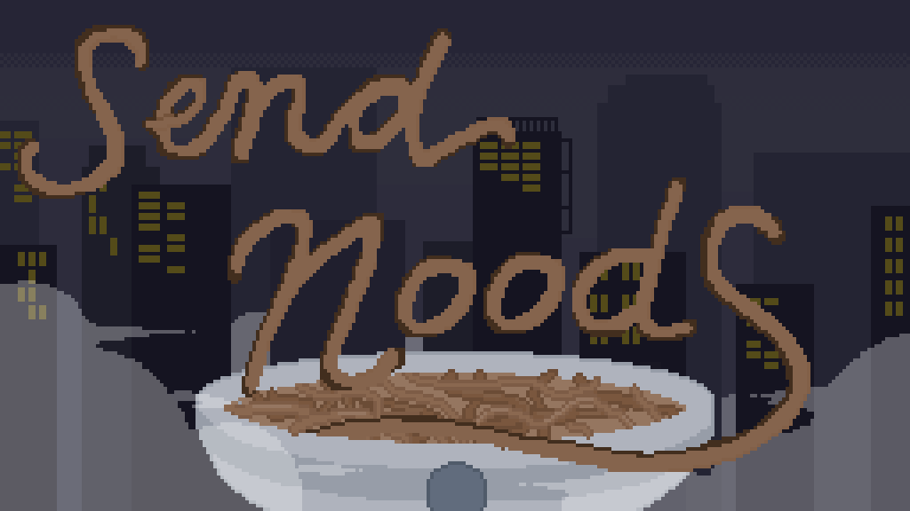
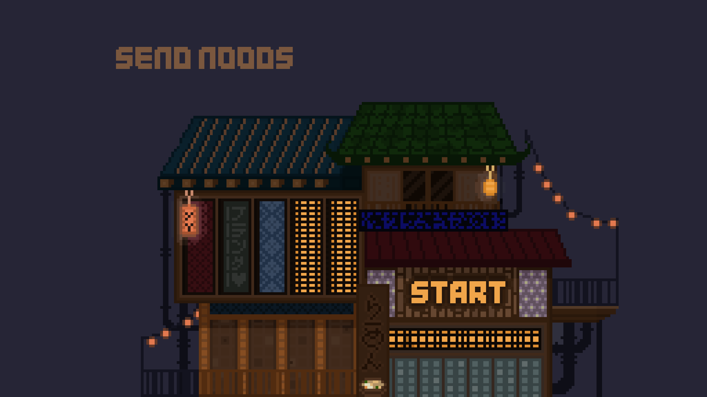
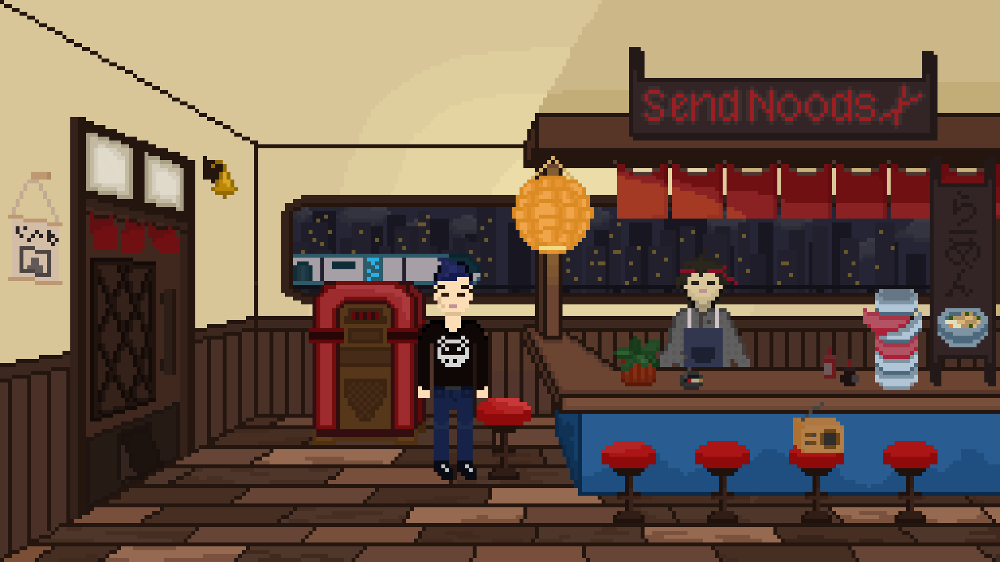

# Send Noods (Unity, C#)

A narrative-driven cooking game where players uncover a personal story by shaping emotions through food.

---

## Overview

Send Noods is a narrative-driven cooking game built in Unity, where players influence characters’ emotions through the food they prepare.

Set in a cozy, present-day noodle shop, the game blends interactive storytelling with light gameplay mechanics. Players use ingredient selection and minigames to uncover information about the protagonist’s lost son.

The project focuses on creating an emotionally engaging player experience through narrative, atmosphere, and player-driven interaction.

---

## 🎮 Gameplay Trailer

https://youtu.be/VWapUM9UpkM

---

## 🕹️ Play the Game

https://nicoleellis.itch.io/send-noods

---

## Screenshots

---

## Key Features

* Narrative-driven gameplay with branching emotional outcomes
* Ingredient selection system influencing character responses
* Drag-and-drop cooking mechanic for assembling dishes
* Minigames and interactive challenges
* Hidden points of interest encouraging exploration
* Original soundtrack and sound design
* Cozy visual style with custom pixel art and animation

---

## My Contributions

I led and contributed across multiple areas of development:

* Designed the core game concept and player experience
* Implemented gameplay systems in Unity (C#)
* Wrote narrative and dialogue systems
* Created pixel art assets and animations
* Produced and integrated the game’s soundtrack
* Designed UI, visual identity, and promotional materials (including trailer)
* Published the game to itch.io

---

## Technologies

* Unity
* C#
* Pixel art pipeline
* Audio production and implementation

---

## Iteration & Design Process

The project underwent multiple iterations based on playtesting and feedback, leading to significant design and system improvements:

* **Cooking Mechanic Redesign**
  Replaced simple button inputs with a drag-and-drop ingredient system, allowing players to physically assemble dishes and increasing interaction depth.

* **Narrative System Improvements**
  Redesigned the dialogue system with a typewriter effect, improved text flow handling, and input controls to balance pacing and player agency.

* **Player Interaction & Flow**
  Adjusted input design (e.g. using keyboard progression instead of rapid clicking) to improve readability and engagement.

* **Expanded Narrative Structure**
  Introduced multiple characters and branching dialogue to increase variety and player choice.

* **Progression Systems**
  Implemented an objectives system to guide player progression and provide a sense of achievement.

* **System Refactoring**
  Reworked narrative parsing logic and consolidated multiple scenes into a single scene to simplify structure and improve maintainability.

---

## Challenges & Tradeoffs

* Encountered issues with event-based interactions (e.g. door animation triggering), highlighting the importance of state management
* Initial narrative parsing approach caused unintended behaviour, leading to a full system redesign
* Time constraints required prioritising core gameplay experience over resolving all minor bugs

---

## Development Focus

This project explored how gameplay mechanics can reinforce narrative themes, particularly through:

* Using food as a medium for emotional storytelling
* Designing interactions that reveal narrative information over time
* Creating a cohesive atmosphere through visuals, sound, and pacing

---

## Outcome

Send Noods was published on itch.io as a playable prototype and represents a complete end-to-end game development process, from concept to release.

---

## Future Improvements

* Expand narrative branching and character depth
* Introduce more complex gameplay systems tied to emotional states
* Improve progression systems and player feedback
* Refine UI/UX for clarity and responsiveness

---

## Team

* Nicole Ellis
* Aaron D'Mello
* Zhiyu Wang
